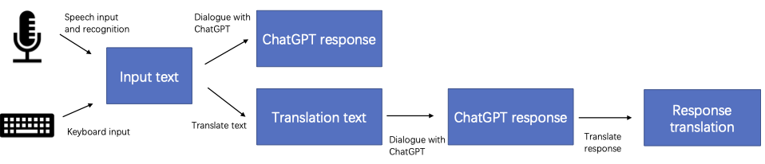

# Multilingual ChatGPT demo

This is a simple ChatGPT demo that supports multilingual speech. We support both speech and text input. For speech data, we use [Recorder.js](https://github.com/mattdiamond/Recorderjs) to record the speech data in the frontend and send it to the backend. Then the speech will be converted to text using [Whisper](https://github.com/openai/whisper).
Our backend will call our multilingual translation service to support languages that are not supported or not proficient in ChatGPT and translate them into English. Then we will use [ChatGPT API](https://platform.openai.com/docs/guides/chat) to get the reply.
The reply will also be translated back to the input language using our multilingual translation service. In addition, some frontend code refers to [this repository](https://github.com/addpipe/simple-recorderjs-demo).

## Motivation
ChatGPT has achieved remarkable results in various natural language tasks. However, due to the training data being 
primarily sourced from English, ChatGPT's support for many other languages 
remains limited or even nonexistent. To address this issue, we integrate our translation service, CONE, with ChatGPT to 
first translate source languages into English, which are then processed by ChatGPT. Subsequently, ChatGPT's 
responses are translated back into the source languages. Moreover, we employ the Whisper model to convert speech into text, 
thereby extending our service to support voice input. This innovative approach aims to enhance the accessibility and applicability 
of ChatGPT across a wider range of languages and modalities.

[//]: # (![demo video]&#40;./image/video_demo.mp4&#41;)

<video width="400" height="240" controls>
  <source src="./image/video_demo.mp4" type="video/mp4">
  Your browser does not support the video tag.
</video>

## Setup

We used Python 3.8 to run our backend code. Please follow the steps below to install the Python environment.

```sh
pip install -r requirements.txt
python -m spacy download en_core_web_md
python -m spacy download zh_core_web_md
```
In addition, [Whisper](https://github.com/openai/whisper) needs to call the command-line tool ffmpeg to convert audio format. The installation methods are as follows.

```sh
# on Ubuntu or Debian
sudo apt update && sudo apt install ffmpeg
# on Arch Linux
sudo pacman -S ffmpeg
# on MacOS using Homebrew (https://brew.sh/)
brew install ffmpeg
# on Windows using Chocolatey (https://chocolatey.org/)
choco install ffmpeg
# on Windows using Scoop (https://scoop.sh/)
scoop install ffmpeg
```
## Usage
If you don't have ChatGPT API keys, please click <a href="https://platform.openai.com/">this link</a> to apply.

Before starting the service, You can adjust the configuration file(config.yml) yourself and modify the following parameters.
```sh
app_name: "Multilingual Speech ChatGPT demo"
API_KEY: "123"   # your OpenAI ChatGPT API key
source_lang: "chinese"  # the source languages for translation service
target_lang: "english"  # the target languages for translation service
output_root: "./cache"  # the local address for backend-generated files
is_trans: True  # whether to open the translation function
is_chatgpt: True  # whether to open the ChatGPT function
split_sentence: True # whether to split long text to sentences when translating (currently only support Chinese and English)
response_trans: chatgpt # This parameter can adjust the translation method of the response for command line version, with three options: "prompt": add a prompt after the input text to request ChatGPT to reply in the specified language, "cone": use CONE translation service to translate ChatGPT's response, and "chatgpt": use a translation prompt to let ChatGPT translate into the specified language.
```

Start the backend.
```sh
python app.py
```
Enter the running domain in the browser. If your browser is unable to display correctly, please try using Chrome
 
Next is the usage pipeline:



As shown in the flowchart, you can choose between voice input or direct text input, 
as well as decide whether to use the translation service to convert your input text into the target language before submitting it to ChatGPT for a response.

[Service Tutorial without translation](./doc/without_translation.md)

[Service Tutorial with translation](./doc/with_translation.md)

We also provide a simple command line version (keyboard input only). You still need to set your parameters in the configuration file(config.yml).

service without translation
```sh
python dialogue.py
```
service with translation
```sh
python dialogue.py  --translate
```
Here is [a simple example](./doc/command_line_case.md) using command line version.


## Supported Languages:
The following are the currently supported languages:
[supported languages](./doc/supported_languages.md)

## Example

we tested whether the answers obtained by translating the text from the source language into English and then asking ChatGPT would be better than using the original text directly.

Here are the evaluation results on Chinese: [case](./doc/chinese_test.md)


