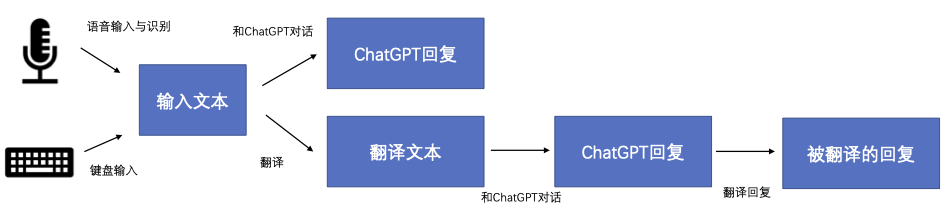

# 多语言ChatGPT

这是一个支持多语言语音的简单ChatGPT演示。我们同时支持语音和文本输入。
我们使用[Streamlit](https://streamlit.io/)来构建我们的应用。我们使用来自[这个仓库](https://github.com/stefanrmmr/streamlit_audio_recorder)的代码来接收前端的录音。
然后，语音会通过[Whisper](https://github.com/openai/whisper)转换为文本。我们的后端将调用我们的多语言翻译服务将识别的文本翻译成英文。
最后我们将使用[ChatGPT API](https://platform.openai.com/docs/guides/chat)来获取回复。回复也将通过我们的多语言翻译服务翻译回输入的语言。


## 动机
ChatGPT在各种自然语言任务中取得了显著的成果。然而，由于训练数据主要来源于英语，ChatGPT对许多其他语言的支持仍然有限甚至不存在。
为了解决这个问题，我们将我们的翻译服务与ChatGPT结合起来，首先将源语言翻译成英语，然后由ChatGPT处理。随后，将ChatGPT的回应翻译回源语言。
此外，我们使用Whisper模型将语音转换为文本，从而扩展我们的服务以支持语音输入。
这种创新方法旨在提高ChatGPT在更广泛的语言和模态范围内的可访问性和适用性。

以下是一个简单的示例，演示如何使用我们的服务。同时，我们可以看到在故事生成时候，相比于右侧直接用中文向ChatGPT提问，左侧英文提问的结果有更多的故事情节和细节。

你可以在这里查看[更多例子](#示例).


[//]: # (<video width="400" height="240" controls>)

[//]: # (  <source src="./image/video_demo.mp4" type="video/mp4">)

[//]: # (  Your browser does not support the video tag.)

[//]: # (</video>)

## 设置

我们使用Python 3.8运行后端代码，请按照以下步骤安装您的Python环境。

```sh
pip install -r requirements.txt
python -m spacy download en_core_web_md
python -m spacy download zh_core_web_md
```
另外, [Whisper](https://github.com/openai/whisper) 需要使用ffmpeg转化音频格式。安装方式如下所示：

```sh
# on Ubuntu or Debian
sudo apt update && sudo apt install ffmpeg
# on Arch Linux
sudo pacman -S ffmpeg
# on MacOS using Homebrew (https://brew.sh/)
brew install ffmpeg
# on Windows using Chocolatey (https://chocolatey.org/)
choco install ffmpeg
# on Windows using Scoop (https://scoop.sh/)
scoop install ffmpeg
```
## 使用
如果你没有ChatGPT API keys，请点击<a href="https://platform.openai.com/">该链接</a>申请。

在开始服务前，你需要调整配置文件(config.yml)，根据你的需求调整参数。

对于 "source_lang" 和 "target_lang", 你可以从[支持语言列表](./doc/supported_languages_chinese.md)中选择。注意: 请使用语言全名。
```sh
app_name: "Multilingual ChatGPT"
API_KEY: "123"   # 你的OpenAI ChatGPT API key
source_lang: "chinese"  # 翻译服务的源语言
target_lang: "english"  # 翻译服务的目标语言
output_root: "./cache"  # 后端产生的文件存储地址
split_sentence: True # 是否分句后调用翻译服务（目前只支持中文和英文输入）
response_trans: chatgpt # 此参数可调整命令行版本翻译ChatGPT回复的方式，有三个选项：“prompt”：在输入文本后添加prompt要求ChatGPT以指定语言回复，“cone”：使用CONE翻译服务翻译ChatGPT的回复，“chatgpt”：使用翻译的prompt让ChatGPT翻译成指定语言。
```

### 网页端
启动后端服务
```sh
streamlit run st_app_main.py
```
请在浏览器中输入IP地址。如果你的浏览器无法正确显示，请尝试使用Chrome浏览器。
 
下图是整个服务的流程：



正如在流程图中所示，你可以选择语音输入或者直接文本输入，你也可以决定是否使用翻译服务。

[不使用翻译功能的服务教程](./doc/without_translation_chinese.md)

[使用翻译功能的服务教程](./doc/with_translation_chinese.md)

### 命令行端
我们也提供了一个简单的command line版本（只支持键盘输入）。你仍然需要在配置文件中（config.yml）设置相关参数。

不使用翻译功能：
```sh
python dialogue.py
```
使用翻译功能：
```sh
python dialogue.py  --translate
```
这里是一个使用命令行的[简单例子](./doc/command_line_case_chinese.md)。


## 示例

我们测试了将文本从源语言翻译成英语然后向ChatGPT提问所获得的答案是否会比直接使用原始文本更好。

这里是在中文上的测试结果: [示例](./doc/chinese_test_chinese.md)

这里是在其他支持语言上的测试结果: [更多语言](./doc/multilingual_evaluation_chinese.md)


