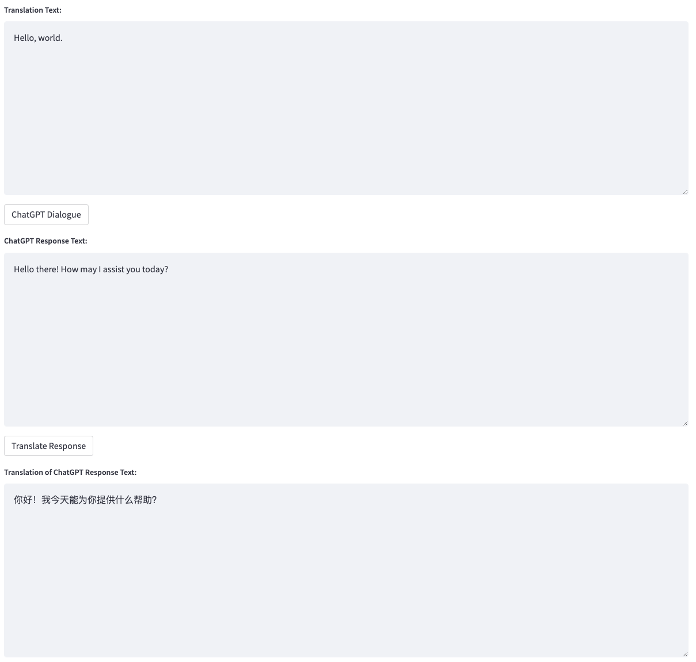

1. Voice input (optional, if not using voice input, proceed directly to step 3): Click the "Record" button to start recording. After clicking the "Stop" button, the recording will stop and be sent to the backend to start the voice recognition process using the Whisper model. You can play the recording to confirm if it was recorded correctly.

2. Text edit and select translation service: The voice recognition results from step 2 will appear in the text input box, or you can also adjust the content of the text input box yourself. After confirming the content, you can use the translation service to translate the input text into the target language specified in your configuration file. We offer two types of translation services: CONE and ChatGPT.

3. Dialogue with ChatGPT: After the translation is complete, you can click the "ChatGPT Dialogue" button to start a conversation with ChatGPT. For the content returned by ChatGPT, you can also use the translation service to translate it back into the source language specified in your configuration file.

