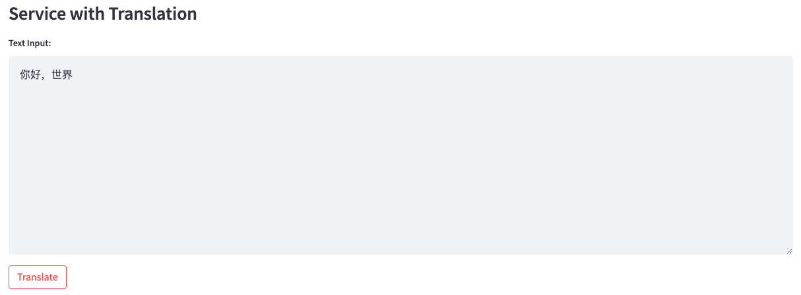

1. 语音输入（**可选**，如果不使用语音输入，请直接进入第2步）：点击“Start Recording”按钮开始录音。
点击“Stop”按钮后，录音将停止并发送到后台,点击"Recognize Audio"后开始使用Whisper模型进行语音识别。您可以播放录音以确认是否正确录制。

2. 文本编辑和选择翻译服务：第1步中的语音识别结果将出现在文本输入框中，或者您也可以自行调整文本输入框的内容。
确认内容后，您可以使用翻译服务将输入的文本翻译成配置文件中指定的目标语言。我们提供两种类型的翻译服务可以选择：CONE和ChatGPT。

3. 和ChatGPT对话: 翻译完成后，你可以点击"ChatGPT Dialogue"按钮开始一个和ChatGPT的对话。对于ChatGPT返回的内容，您还可以使用翻译服务将其翻译回配置文件中指定的源语言。

