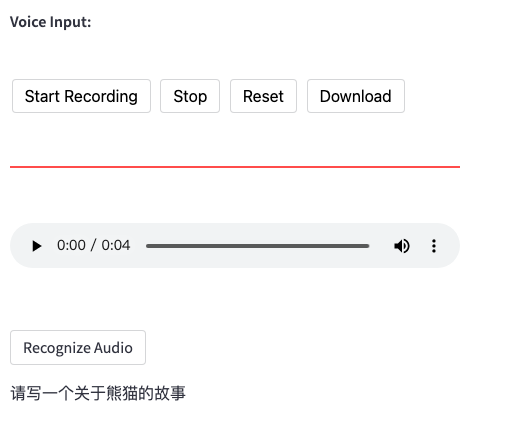

1. Voice input (**optional**, if not using voice input, proceed directly to step 2): Click the "Start Recording" button to start recording. 
After clicking the "Stop" button, the recording will stop and be sent to the backend to start the voice recognition process after clicking "Recognize Audio". 
You can play the recording to confirm if it was recorded correctly.

   
2. Dialogue with ChatGPT: You can directly click "ChatGPT Dialogue" to start a conversation with ChatGPT.
 